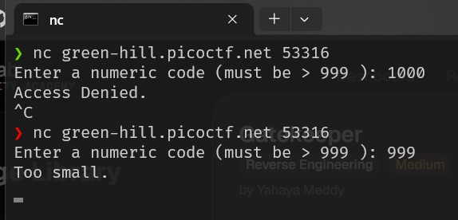
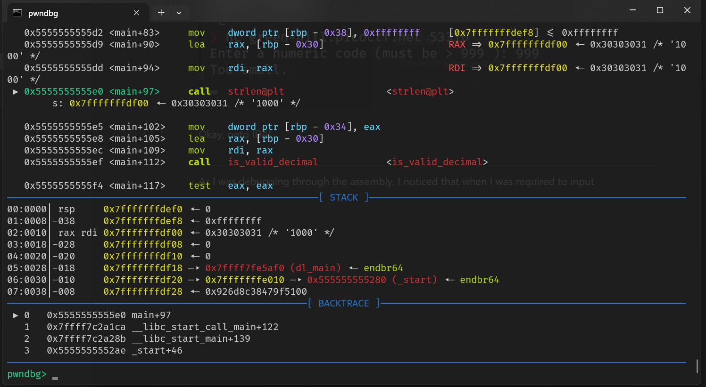
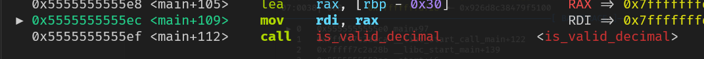
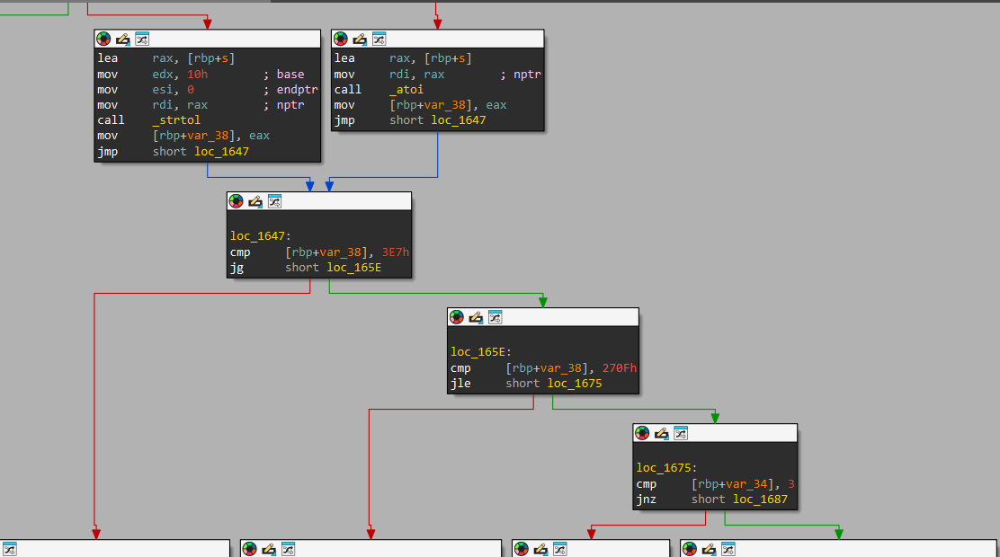
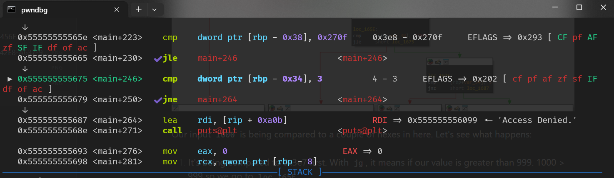
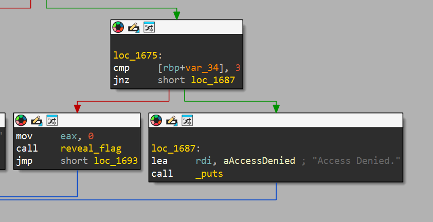
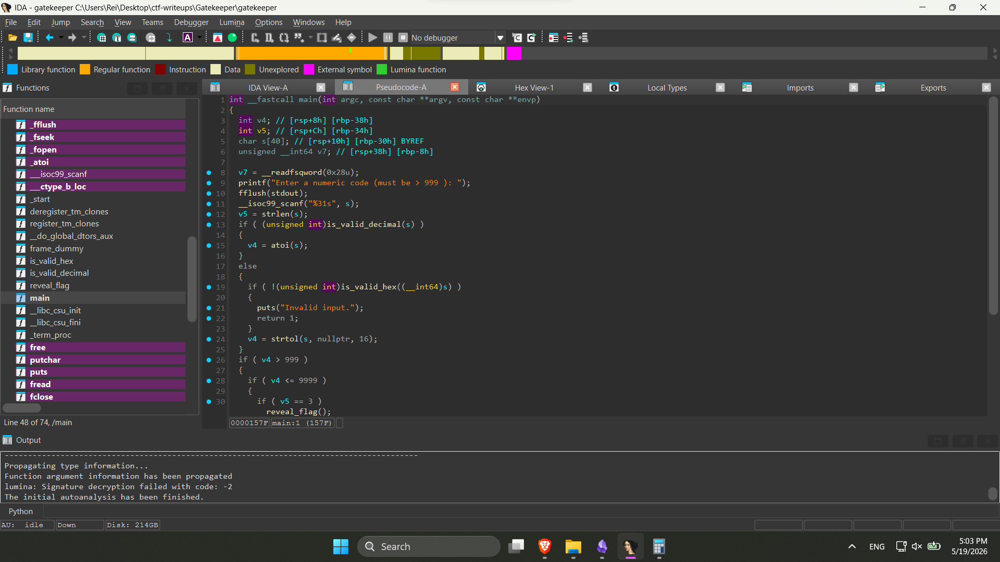

# Gatekeeper
`#Reverse-Engineering` <mark style="background-color: #3d2a1d; color: #e5a93c; border-radius: 10px; padding: 2px 8px; font-size: 0.85em;">Medium</mark> 
<font color="#7a7a7a">by Yahaya Meddy</font>

What's behind the numeric gate? You only get access if you enter the *right* kind of number. You can download the program file [here](https://example.com).

---
Upon starting the challenge, I immediately downloaded the file and got this gatekeeper ELF64 (elf.dll).

Looking at the functions in IDA, there are some *interesting* functions in here, namely:
1. is_valid_hex
2. is_valid_decimal
3. reveal_flag

Ooookay.. let's try out this program first by launching `nc green-hill.picoctf.net <port>` instance.



Okay, onto IDA!

----
As I was debugging through the assembly, I noticed that when I was required to input, it was calling the `strlen()` function a few lines later. **Let's keep that in mind**.



We see the first call to the function `is_valid_decimal()`, as from the name of  the function, this just checks if the input is a valid decimal I guess.



And then for some reason, it calls `atoi()`.. I forgot what that does so we'll proceed further.



Our input `1000` is being compared to a couple of hexes in here. Let's see what happens:

1. It's being compared to 0x3e7 first. With `jg`, it means if our value is greater than 999. 1000 > 999 so we go to `loc_165E`.
2. Now it's being compared to 0x270f (9999). Jump if less than or equal to, so 1000 <= 9999. So we jump to `loc_1675`.



Oh now this is weird.. what's up with 3? `rbp-0x34`'s value is 4. So jnz means we go to the next location which is..



**ACCESS DENIED**. Hmm, what's up with that 3?

-------
Going back to the upper branches, there was a function named `is_valid_hex()`. Looks like for some reason, the input is also accepting hexes?

```nasm
.text:0000000000001369                 endbr64
.text:000000000000136D                 push    rbp
.text:000000000000136E                 mov     rbp, rsp
.text:0000000000001371                 sub     rsp, 20h
.text:0000000000001375                 mov     [rbp+var_18], rdi
.text:0000000000001379                 mov     [rbp+var_4], 0
.text:0000000000001380                 jmp     short loc_13BE
.text:0000000000001382 ; ---------------------------------------------------------------------------
.text:0000000000001382
.text:0000000000001382 loc_1382:                               ; CODE XREF: is_valid_hex+67↓j
.text:0000000000001382                 call    ___ctype_b_loc
.text:0000000000001387                 mov     rax, [rax]
.text:000000000000138A                 mov     edx, [rbp+var_4]
.text:000000000000138D                 movsxd  rcx, edx
.text:0000000000001390                 mov     rdx, [rbp+var_18]
.text:0000000000001394                 add     rdx, rcx
.text:0000000000001397                 movzx   edx, byte ptr [rdx]
.text:000000000000139A                 movsx   rdx, dl
.text:000000000000139E                 add     rdx, rdx
.text:00000000000013A1                 add     rax, rdx
.text:00000000000013A4                 movzx   eax, word ptr [rax]
.text:00000000000013A7                 movzx   eax, ax
.text:00000000000013AA                 and     eax, 1000h
.text:00000000000013AF                 test    eax, eax
.text:00000000000013B1                 jnz     short loc_13BA
.text:00000000000013B3                 mov     eax, 0
.text:00000000000013B8                 jmp     short locret_13D7
.text:00000000000013BA ; ---------------------------------------------------------------------------
.text:00000000000013BA
.text:00000000000013BA loc_13BA:                               ; CODE XREF: is_valid_hex+48↑j
.text:00000000000013BA                 add     [rbp+var_4], 1
.text:00000000000013BE
.text:00000000000013BE loc_13BE:                               ; CODE XREF: is_valid_hex+17↑j
.text:00000000000013BE                 mov     eax, [rbp+var_4]
.text:00000000000013C1                 movsxd  rdx, eax
.text:00000000000013C4                 mov     rax, [rbp+var_18]
.text:00000000000013C8                 add     rax, rdx
.text:00000000000013CB                 movzx   eax, byte ptr [rax]
.text:00000000000013CE                 test    al, al
.text:00000000000013D0                 jnz     short loc_1382
.text:00000000000013D2                 mov     eax, 1
.text:00000000000013D7
.text:00000000000013D7 locret_13D7:                            ; CODE XREF: is_valid_hex+4F↑j
.text:00000000000013D7                 leave
.text:00000000000013D8                 retn
.text:00000000000013D8 ; } // starts at 1369
.text:00000000000013D8 is_valid_hex    endp
```

Yeah I don't understand this LOL. But let us focus on the fact that this focus accepts hex numbers. For some reason, I remembered the ominous "3" we encountered on the final `cmp` instruction that brought us to the denial of access, and then at the same time, I also remembered the `strlen()` function we encountered awhile ago. Hmm, nothing still makes sense, let's go through the decompiler:



Yeah.. a variable `v5` is being used to store the value of `strlen(s)` with s being the place our input (1000) is stored before. So.. it looks like it is indeed checking if the input is a hexadecimal.

..oh fucking wait, what is 1000 in hexadecimal? 


3E8. If we put this in `s`, then `strlen(s)` gets called, we get 3! Then if that's the case, any hexes that is 3 in length but is 999 > n <= 9999 will basically work. 

```bash
❯ nc green-hill.picoctf.net 65136
Enter a numeric code (must be > 999 ): 0x3e8
Invalid input.
^C
❯ nc green-hill.picoctf.net 65136
Enter a numeric code (must be > 999 ): 3e8
Access granted: }af5ftc_oc_ip7128ftc_oc_ipf_99ftc_oc_ip9_TGftc_oc_ip_xehftc_oc_ip_tigftc_oc_ipid_3ftc_oc_ip{FTCftc_oc_ipocipftc_oc_ip
```

Hell fucking yes. Now, obviously its somewhat 'encrypted', but I can make up the words picoCTF in here, with the curly brackets in here, so thankfully it wasn't cryptographically encrypted. Let's see what the `reveal_flag()` option does:

```C
void reveal_flag()
{
  int i; // [rsp+4h] [rbp-1Ch]
  FILE *stream; // [rsp+8h] [rbp-18h]
  __int64 n; // [rsp+10h] [rbp-10h]
  char *ptr; // [rsp+18h] [rbp-8h]

  stream = fopen("/flag.txt", "r");
  if ( stream )
  {
    fseek(stream, 0, 2);
    n = ftell(stream);
    rewind(stream);
    ptr = (char *)malloc(n + 1);
    if ( ptr )
    {
      fread(ptr, 1u, n, stream);
      ptr[n] = 0;
      fclose(stream);
      printf("Access granted: ");
      for ( i = n - 1; i >= 0; --i )
      {
        putchar(ptr[i]);
        if ( (i & 3) == 0 )
          printf("ftc_oc_ip");
      }
      putchar(10);
      free(ptr);
    }
  }
  else
  {
    puts("Flag file not found.");
  }
}
```

I can make up the logic of... 10% of this code. Well, let's examine this for a bit. I came across these concepts before when I was reading Dive Into Systems (Chapter 2 - I/O in C (Standard and File)) but I gave up halfway through because I found myself getting too confused at this point and decided to quit.. karma hits fast ig.

But anyways, as I don't understand what's going on, we can infer that this string is reversed, as obvious as it is. 

```shell
Access granted: }af5ftc_oc_ip7128ftc_oc_ipf_99ftc_oc_ip9_TGftc_oc_ip_xehftc_oc_ip_tigftc_oc_ipid_3ftc_oc_ip{FTCftc_oc_ipocipftc_oc_ip
```

But this excerpt in the code stuck in me:

```c
printf("Access granted: ");
      for ( i = n - 1; i >= 0; --i )
      {
        putchar(ptr[i]);
        if ( (i & 3) == 0 )
          printf("ftc_oc_ip");
      }
```

I still don't get what the logic does, but it looks like it's inserting and appending the string "ftc_oc_ip" every `n` times. Okay.. let's remove those:

```shell
Access granted: }af57128f_999_TG_xeh_tigid_3{FTCocip
```

Reverse, and get the flag.

